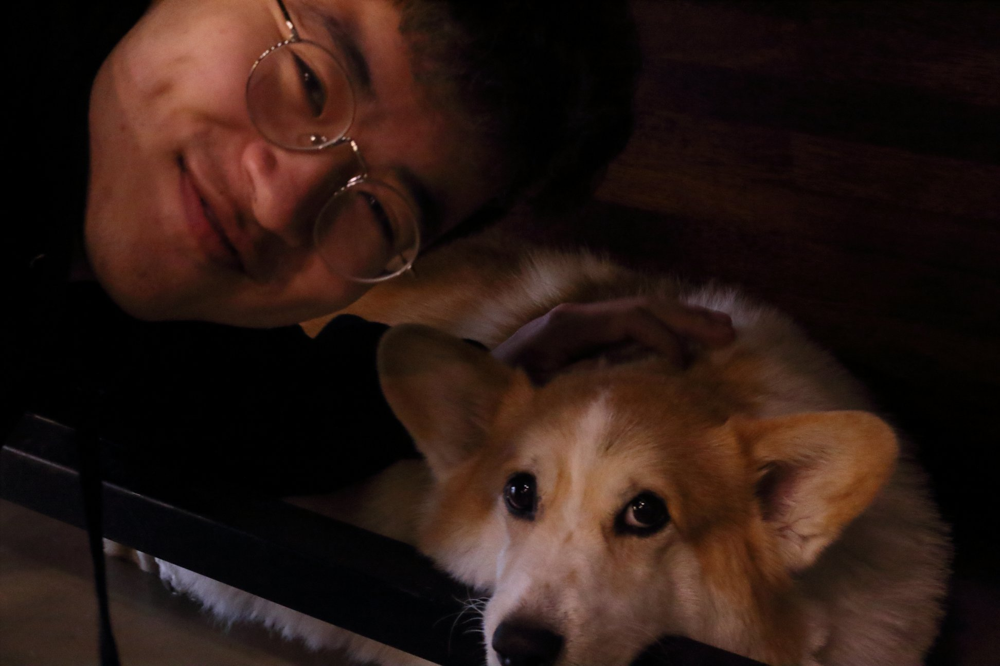

 

I graduated from Dartmouth College with a bachelor's in computer science in 2019, and have been working at Meta (Facebook) as a software engineer for over 3 years. You can find several papers describing some of the work I've been doing at Meta [here](https://arxiv.org/pdf/2010.09974.pdf) and [here](https://arxiv.org/pdf/2110.10450.pdf). If you want to connect, my information should be in the footer.

I'm building this blog site mostly for myself so I can 1. keep track of what all I am doing and plan to do, and 2. keep myself accountable so I don't get lazy (motivation can be hard!). I imagine parts of this website may be useful for other people looking to make their own curriculums to self-study deep learning, especially the resources section.
